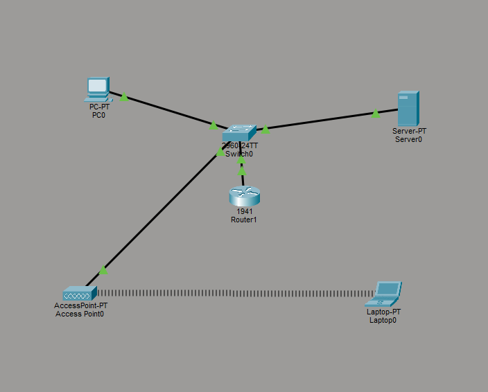
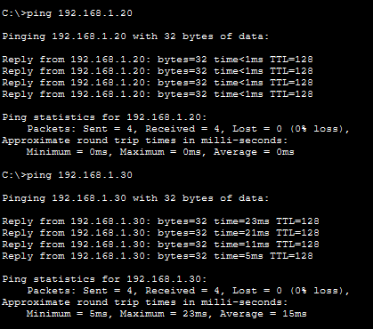
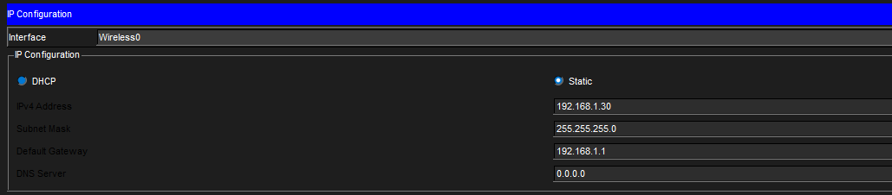

# Lab 1 - OSI Model and Networking Devices (Packet Tracer)

## Objective
Build a simple network using Cisco Packet Tracer and understand how devices communicate.

## Tools Used
- Cisco Packet Tracer

## Topology
PC → Switch → Router → Server  
         ↓  
     Access Point → Laptop  

## Configuration
- Assigned static IP addresses to all devices
- Configured router interface as default gateway (192.168.1.1)
- Installed wireless NIC on laptop and connected to access point

## Testing
- Successfully pinged server from PC
- Successfully pinged laptop from PC after fixing wireless IP issue

## Screenshots

## Key Takeaways
- Switch operates at Layer 2 and connects devices in a LAN
- Router operates at Layer 3 and routes traffic between networks
- Wireless devices require proper NIC and configuration
- Troubleshooting is a key part of networking

## Skills Practiced
- Network setup in Packet Tracer
- IP configuration
- Wireless troubleshooting
- Connectivity testing
