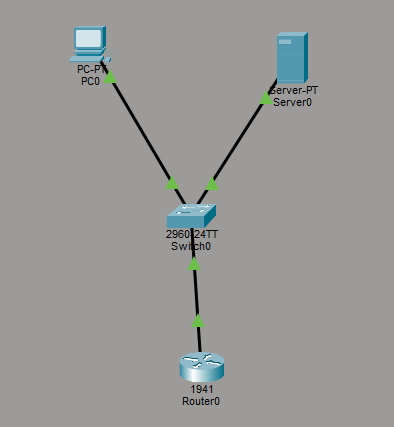
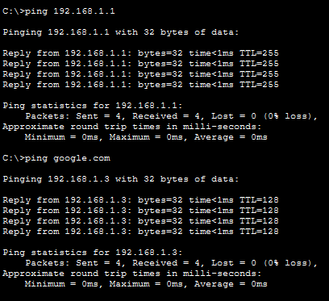
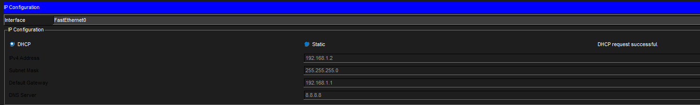

# Lab 2 - Networking Functions (DHCP + DNS)

## Objective
Configure DHCP and DNS in Cisco Packet Tracer and verify network functionality.

## Tools Used
- Cisco Packet Tracer

## Topology
PC → Switch → Router → Server

## Configuration
- Configured router as default gateway (192.168.1.1)
- Set up DHCP on router to automatically assign IP addresses
- Configured DNS service on server
- Created DNS record (google.com)

## Testing
- Verified PC received IP automatically using DHCP
- Successfully pinged router (192.168.1.1)
- Successfully resolved and pinged google.com using DNS

## Screenshots

## Key Takeaways
- DHCP automatically assigns IP configuration to devices
- DNS resolves domain names to IP addresses
- Network communication requires both addressing and routing
- Troubleshooting is essential when services fail

## Skills Practiced
- DHCP configuration
- DNS configuration
- Network troubleshooting
- Connectivity testing
