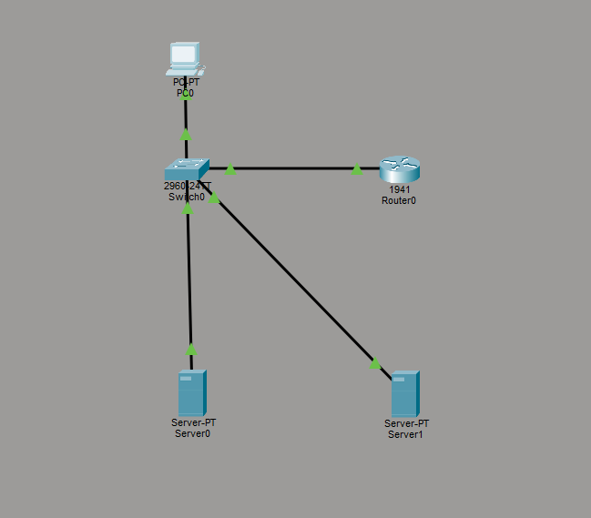
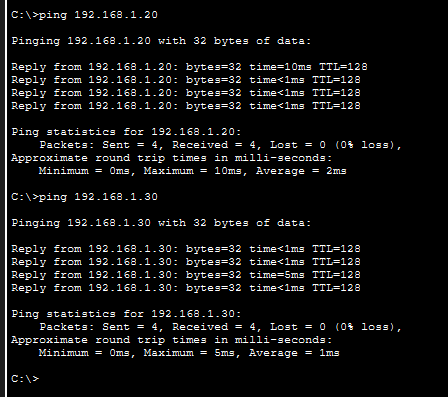
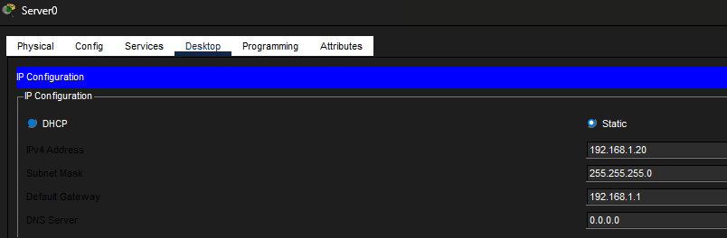

# Lab 3 - Cloud Basics (VPC, Public vs Private)

## Objective
Simulate a cloud network and understand public vs private resources using Cisco Packet Tracer.

## Tools Used
- Cisco Packet Tracer

## Topology
PC → Switch → Router → Server 1 (Public)  
                     → Server 2 (Private)

## Configuration
- Configured router as internet gateway (192.168.1.1)
- Assigned IP addresses to all devices
- Simulated public and private servers

## Testing
- Successfully pinged public server (192.168.1.20)
- Successfully pinged private server (192.168.1.30)

## Screenshots

## Key Takeaways
- A VPC is a private network inside the cloud
- Public resources are accessible from outside networks
- Private resources should be restricted
- Routers act as internet gateways
- Security controls (like firewalls/security groups) control access

## Skills Practiced
- Network design
- Understanding cloud architecture
- Public vs private segmentation concepts
