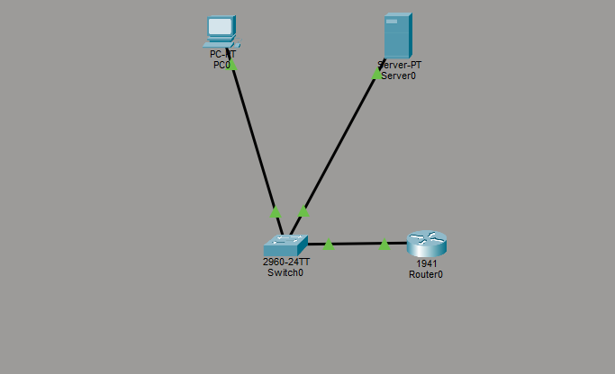
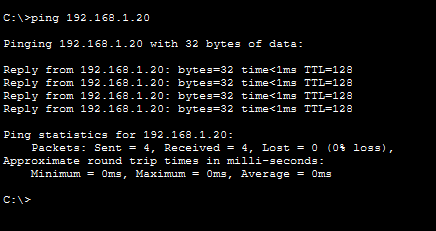
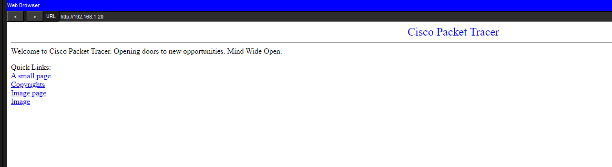
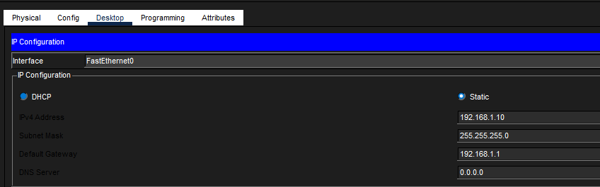

# Lab 4 - IP, Ports, and Protocols (HTTP Test)

## Objective
Configure a basic network and demonstrate how protocols like HTTP work using Cisco Packet Tracer.

## Tools Used
- Cisco Packet Tracer

## Topology
PC → Switch → Router → Server

## Configuration
- Configured router as default gateway (192.168.1.1)
- Assigned static IP addresses to PC and server
- Enabled HTTP service on server

## Testing
- Successfully pinged server (192.168.1.20)
- Accessed web server using browser (http://192.168.1.20)

## Screenshots

## Key Takeaways
- IP addressing allows devices to communicate on a network
- HTTP (port 80) is used for web communication
- Ping tests network connectivity (Layer 3)
- Web browsers use application layer protocols (Layer 7)

## Skills Practiced
- IP configuration
- Basic routing
- Protocol testing (HTTP)
- Application-layer troubleshooting
